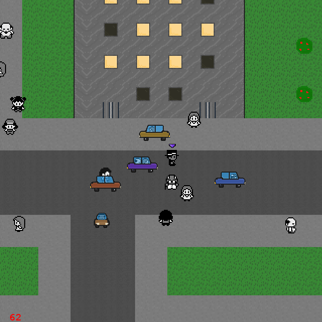

# CitySimulator
2D city simulator [prototype](https://github.com/DomWilliams0/CitySimulator), made with pygame.

## Usage
* Install `PyYAML` and `pygame`
* Run with `python2 core.py`
* Realise that this is not the state of the art city simulator you were expecting

## Controls
* Click on a person to control them with `WASD`
* Press `TAB` to let them get back to their business
* Click on doors to enter buildings

